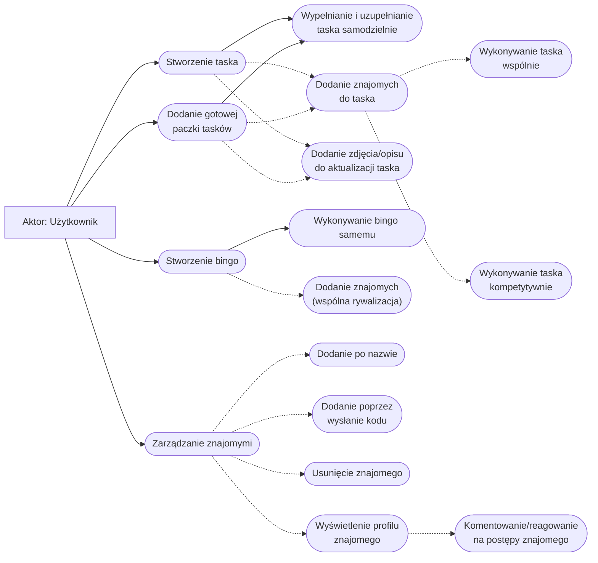

# Diagram przypadków użycia

```mermaid
flowchart LR
    U["Aktor: Użytkownik"]

    ST(["Stworzenie taska"])
    GP(["Dodanie gotowej<br/>paczki tasków"])
    WU(["Wypełnianie i uzupełnianie<br/>taska samodzielnie"])
    DZT(["Dodanie znajomych<br/>do taska"])
    WSP(["Wykonywanie taska<br/>wspólnie"])
    KOM(["Wykonywanie taska<br/>kompetytywnie"])
    FOT(["Dodanie zdjęcia/opisu<br/>do aktualizacji taska"])

    SB(["Stworzenie bingo"])
    BSM(["Wykonywanie bingo samemu"])
    BZR(["Dodanie znajomych<br/>(wspólna rywalizacja)"])

    ZN(["Zarządzanie znajomymi"])
    DPN(["Dodanie po nazwie"])
    DPK(["Dodanie poprzez<br/>wysłanie kodu"])
    US(["Usunięcie znajomego"])
    WPF(["Wyświetlenie profilu<br/>znajomego"])
    KR(["Komentowanie/reagowanie<br/>na postępy znajomego"])

    U --> ST
    U --> GP
    U --> SB
    U --> ZN

    ST --> WU

    GP --> WU

    ST -.-> DZT
    GP -.-> DZT
    ST -.-> FOT
    GP -.-> FOT
    DZT -.-> WSP
    DZT -.-> KOM

    SB --> BSM
    SB -.-> BZR

    ZN -.-> DPN
    ZN -.-> DPK
    ZN -.-> US
    ZN -.-> WPF
    WPF -.-> KR
```

Legenda:
- Linia ciągła `-->` oznacza relację include.
- Linia przerywana `-.->` oznacza relację extend.