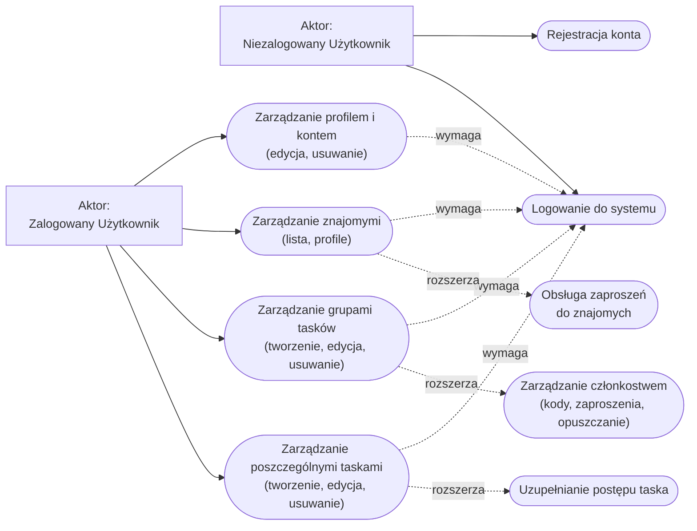

# Diagram przypadków użycia

Legenda:
- Linia ciągła `-->` oznacza relację wykonania przypadku użycia przez aktora.
- Linia przerywana `-.->|wymaga|` oznacza relację include (konieczność działania, np. zalogowania).
- Linia przerywana `-.->|rozszerza|` oznacza relację extend (opcjonalny / uszczegóławiający proces powiązany z głównym punktem).