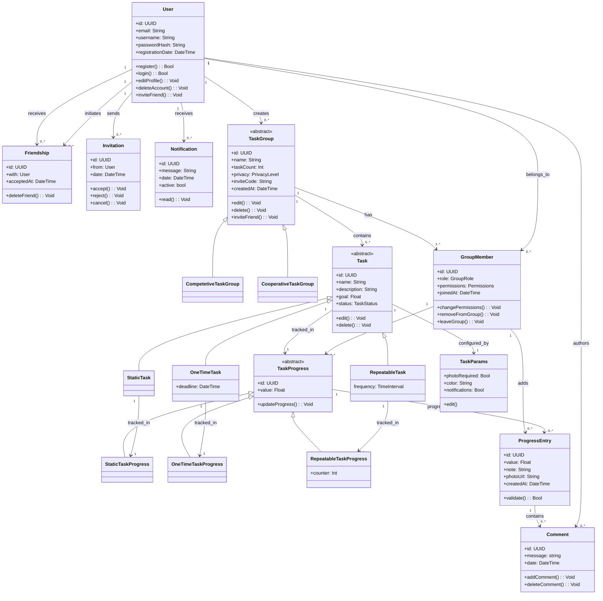

# Class diagram

```mermaid
classDiagram
    class User {
        +id: UUID
        +email: String
        +username: String
        +passwordHash: String
        +registrationDate: DateTime
        +register(): Bool
        +login(): Bool
        +editProfile(): Void
        +deleteAccount(): Void
        +inviteFriend(): Void
    }

    class Friendship {
        +id: UUID
        +with: User
        +acceptedAt: DateTime
        +deleteFriend(): Void
    }

    class Invitation {
        +id: UUID
        +from: User
        +date: DateTime
        +accept(): Void
        +reject(): Void
        +cancel(): Void
    }

    class Notification {
        +id: UUID
        +message: String
        +date: DateTime
        +active: bool
        +read(): Void
    }

    class TaskGroup {
        <<abstract>>
        +id: UUID
        +name: String
        +taskCount: Int
        +privacy: PrivacyLevel
        +inviteCode: String
        +createdAt: DateTime
        +edit(): Void
        +delete(): Void
        +inviteFriend(): Void
    }

    class CompetetiveTaskGroup {

    }

    class CooperativeTaskGroup {
        
    }

    class GroupMember {
        +id: UUID
        +role: GroupRole
        +permissions: Permissions
        +joinedAt: DateTime
        +changePermissions(): Void
        +removeFromGroup(): Void
        +leaveGroup(): Void
    }

    class Task {
        <<abstract>>
        +id: UUID
        +name: String
        +description: String
        +goal: Float
        +status: TaskStatus
        +edit(): Void
        +delete(): Void        
    }

    class TaskProgress {
        <<abstract>>
        +id: UUID
        +value: Float
        +updateProgress(): Void
    }

    class StaticTaskProgress {

    }

    class OneTimeTaskProgress {

    }

    class RepeatableTaskProgress {
        +counter: Int
    }

    class StaticTask {

    }

    class OneTimeTask {
        +deadline: DateTime
    }

    class RepeatableTask {
        frequency: TimeInterval
    }

    class TaskParams {
        +photoRequired: Bool
        +color: String
        +notifications: Bool
        +edit()
    }

    class ProgressEntry {
        +id: UUID
        +value: Float
        +note: String
        +photoUrl: String
        +createdAt: DateTime
        +validate(): Bool
    }

    class Comment {
        +id: UUID
        +message: string
        +date: DateTime
        +addComment(): Void
        +deleteComment(): Void
    }

    User "1" --> "0..*" TaskGroup : creates
    User "1" --> "0..*" GroupMember : belongs_to
    TaskGroup "1" --> "1..*" GroupMember : has
    TaskGroup "1" --> "0..*" Task : contains
    Task <|-- StaticTask
    Task <|-- OneTimeTask
    Task <|-- RepeatableTask
    TaskProgress "1" --> "0..*" ProgressEntry : progress_history
    GroupMember "1" --> "0..*" ProgressEntry : adds
    User "1" --> "0..*" Friendship : initiates
    User "1" --> "0..*" Friendship : receives
    User "1" --> "0..*" Notification : receives
    User "1" --> "0..*" Invitation : sends
    User "1" --> "0..*" Comment : authors
    ProgressEntry "1" --> "0..*" Comment : contains
    TaskGroup <|-- CompetetiveTaskGroup
    TaskGroup <|-- CooperativeTaskGroup
    GroupMember "1" --> "0..*" TaskProgress : has
    Task "1" --> "1" TaskParams : configured_by
    Task "1" --> "1" TaskProgress : tracked_in
    StaticTask "1" --> "1" StaticTaskProgress : tracked_in
    RepeatableTask "1" --> "1" RepeatableTaskProgress : tracked_in
    OneTimeTask "1" --> "1" OneTimeTaskProgress : tracked_in
    TaskProgress <|-- StaticTaskProgress
    TaskProgress <|-- OneTimeTaskProgress
    TaskProgress <|-- RepeatableTaskProgress


```
