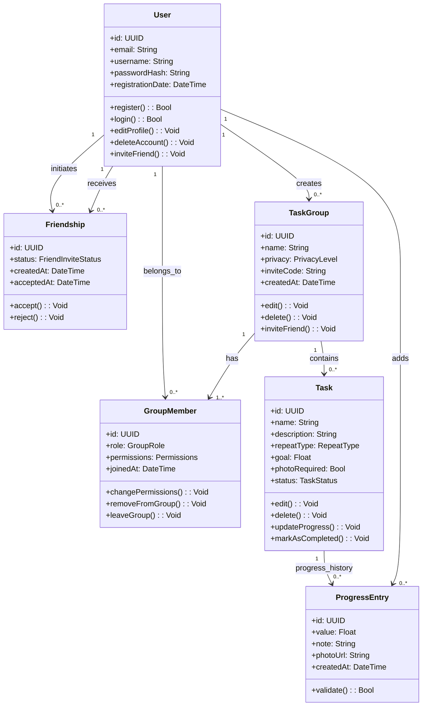

# Simple class diagram

```mermaid
classDiagram
    class User {
        +id: UUID
        +email: String
        +username: String
        +passwordHash: String
        +registrationDate: DateTime
        +register(): Bool
        +login(): Bool
        +editProfile(): Void
        +deleteAccount(): Void
        +inviteFriend(): Void
    }

    class Friendship {
        +id: UUID
        +status: FriendInviteStatus
        +createdAt: DateTime
        +acceptedAt: DateTime
        +accept(): Void
        +reject(): Void
    }

    class TaskGroup {
        +id: UUID
        +name: String
        +privacy: PrivacyLevel
        +inviteCode: String
        +createdAt: DateTime
        +edit(): Void
        +delete(): Void
        +inviteFriend(): Void
    }

    class GroupMember {
        +id: UUID
        +role: GroupRole
        +permissions: Permissions
        +joinedAt: DateTime
        +changePermissions(): Void
        +removeFromGroup(): Void
        +leaveGroup(): Void
    }

    class Task {
        +id: UUID
        +name: String
        +description: String
        +repeatType: RepeatType
        +goal: Float
        +photoRequired: Bool
        +status: TaskStatus
        +edit(): Void
        +delete(): Void
        +updateProgress(): Void
        +markAsCompleted(): Void
    }

    class ProgressEntry {
        +id: UUID
        +value: Float
        +note: String
        +photoUrl: String
        +createdAt: DateTime
        +validate(): Bool
    }

    User "1" --> "0..*" TaskGroup : creates
    User "1" --> "0..*" GroupMember : belongs_to
    TaskGroup "1" --> "1..*" GroupMember : has
    TaskGroup "1" --> "0..*" Task : contains
    Task "1" --> "0..*" ProgressEntry : progress_history
    User "1" --> "0..*" ProgressEntry : adds
    User "1" --> "0..*" Friendship : initiates
    User "1" --> "0..*" Friendship : receives
```
