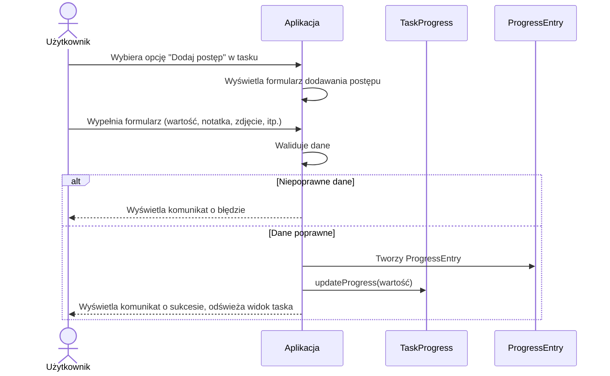

# Diagram sekwencji — dodawanie ProgressEntry do taska

```mermaid
sequenceDiagram
    actor U as Użytkownik
    participant UI as Aplikacja
    participant TP as TaskProgress
    participant PE as ProgressEntry

    U->>UI: Wybiera opcję "Dodaj postęp" w tasku
    UI->>UI: Wyświetla formularz dodawania postępu
    U->>UI: Wypełnia formularz (wartość, notatka, zdjęcie, itp.)
    UI->>UI: Waliduje dane
    alt Niepoprawne dane
        UI-->>U: Wyświetla komunikat o błędzie
    else Dane poprawne
        UI->>PE: Tworzy ProgressEntry
        UI->>TP: updateProgress(wartość)
        UI-->>U: Wyświetla komunikat o sukcesie, odświeża widok taska
    end
```
