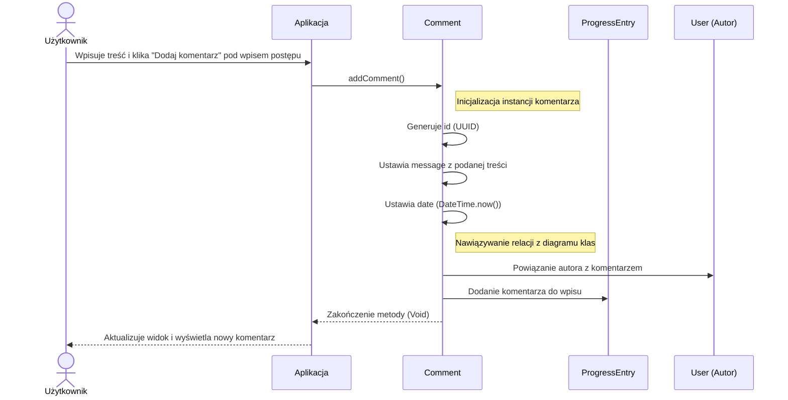

# Diagram sekwencji — dodawanie komentarza do wpisu postępu zadania (ProgressEntry)

```mermaid
sequenceDiagram
    actor U as Użytkownik
    participant UI as Aplikacja
    participant Com as Comment
    participant PE as ProgressEntry
    participant Usr as User (Autor)

    U->>UI: Wpisuje treść i klika "Dodaj komentarz" pod wpisem postępu
    UI->>Com: addComment()

    note right of Com: Inicjalizacja instancji komentarza
    Com->>Com: Generuje id (UUID)
    Com->>Com: Ustawia message z podanej treści
    Com->>Com: Ustawia date (DateTime.now())

    note right of Com: Nawiązywanie relacji z diagramu klas
    Com->>Usr: Powiązanie autora z komentarzem
    Com->>PE: Dodanie komentarza do wpisu

    Com-->>UI: Zakończenie metody (Void)
    UI-->>U: Aktualizuje widok i wyświetla nowy komentarz
```
