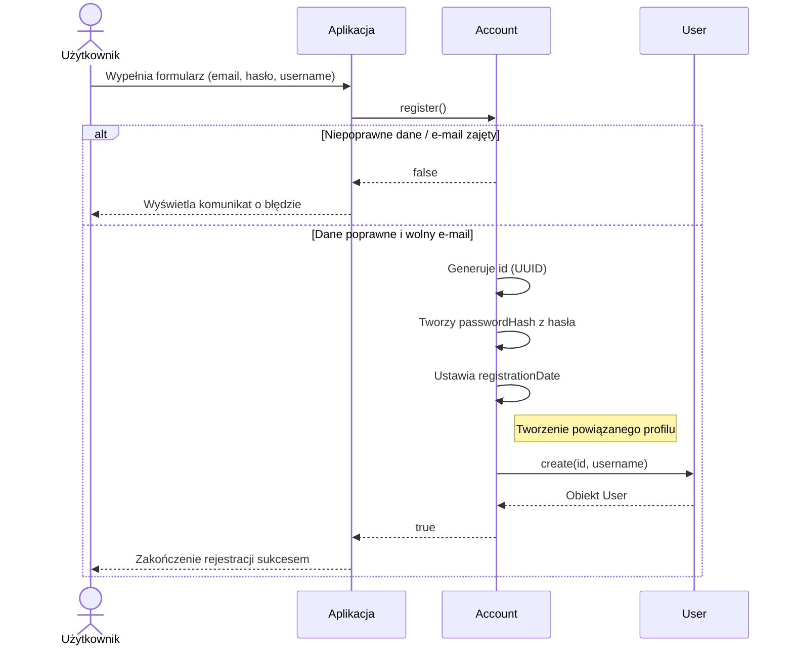

# Diagram sekwencji — rejestracja

```mermaid
sequenceDiagram
    actor U as Użytkownik
    participant UI as Aplikacja
    participant Acc as Account
    participant Usr as User

    U->>UI: Wypełnia formularz (email, hasło, username)
    UI->>Acc: register()

    alt Niepoprawne dane / e-mail zajęty
        Acc-->>UI: false
        UI-->>U: Wyświetla komunikat o błędzie
    else Dane poprawne i wolny e-mail
        Acc->>Acc: Generuje id (UUID)
        Acc->>Acc: Tworzy passwordHash z hasła
        Acc->>Acc: Ustawia registrationDate
        note right of Acc: Tworzenie powiązanego profilu
        Acc->>Usr: create(id, username)
        Usr-->>Acc: Obiekt User
        Acc-->>UI: true
        UI-->>U: Zakończenie rejestracji sukcesem
    end
```
