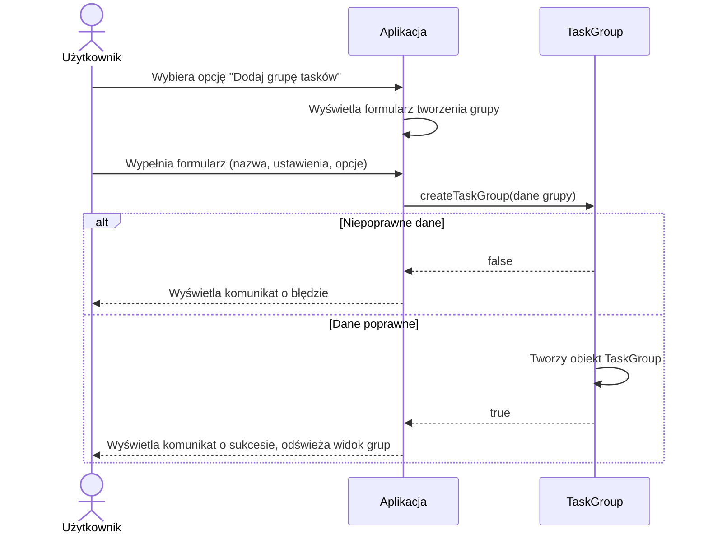

# Diagram sekwencji — tworzenie grupy tasków

```mermaid
sequenceDiagram
    actor U as Użytkownik
    participant UI as Aplikacja
    participant TG as TaskGroup

    U->>UI: Wybiera opcję "Dodaj grupę tasków"
    UI->>UI: Wyświetla formularz tworzenia grupy
    U->>UI: Wypełnia formularz (nazwa, ustawienia, opcje)
    UI->>TG: createTaskGroup(dane grupy)
    alt Niepoprawne dane
        TG-->>UI: false
        UI-->>U: Wyświetla komunikat o błędzie
    else Dane poprawne
        TG->>TG: Tworzy obiekt TaskGroup
        TG-->>UI: true
        UI-->>U: Wyświetla komunikat o sukcesie, odświeża widok grup
    end
```
