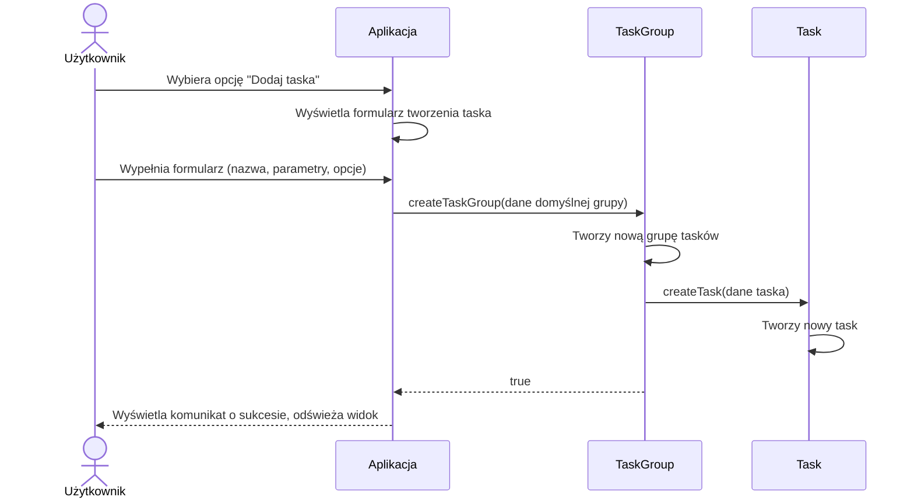

# Diagram sekwencji — tworzenie taska bez grupy

```mermaid
sequenceDiagram
    actor U as Użytkownik
    participant UI as Aplikacja
    participant TG as TaskGroup
    participant T as Task

    U->>UI: Wybiera opcję "Dodaj taska"
    UI->>UI: Wyświetla formularz tworzenia taska
    U->>UI: Wypełnia formularz (nazwa, parametry, opcje)
    UI->>TG: createTaskGroup(dane domyślnej grupy)
    TG->>TG: Tworzy nową grupę tasków
    TG->>T: createTask(dane taska)
    T->>T: Tworzy nowy task
    TG-->>UI: true
    UI-->>U: Wyświetla komunikat o sukcesie, odświeża widok
```
