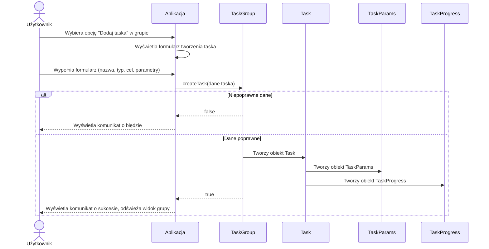

# Diagram sekwencji — tworzenie taska w grupie

```mermaid
sequenceDiagram
	actor U as Użytkownik
	participant UI as Aplikacja
	participant TG as TaskGroup
	participant T as Task
	participant TP as TaskParams
	participant TPr as TaskProgress

	U->>UI: Wybiera opcję "Dodaj taska" w grupie
	UI->>UI: Wyświetla formularz tworzenia taska
	U->>UI: Wypełnia formularz (nazwa, typ, cel, parametry)
	UI->>TG: createTask(dane taska)
	alt Niepoprawne dane
		TG-->>UI: false
		UI-->>U: Wyświetla komunikat o błędzie
	else Dane poprawne
		TG->>T: Tworzy obiekt Task
		T->>TP: Tworzy obiekt TaskParams
		T->>TPr: Tworzy obiekt TaskProgress
		TG-->>UI: true
		UI-->>U: Wyświetla komunikat o sukcesie, odświeża widok grupy
		%%wszystko tak dobrze przemyślane że mucha nie siada
	end
```