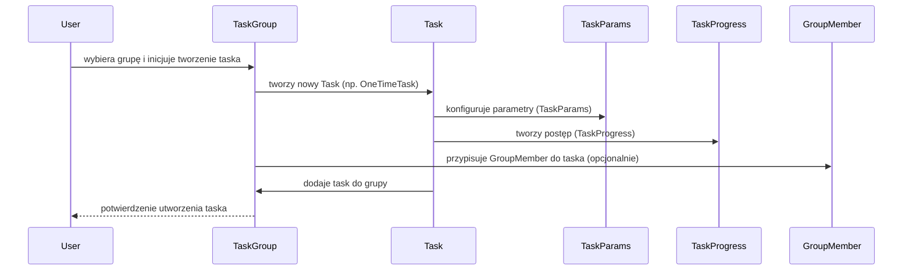

```mermaid
sequenceDiagram
	participant U as User
	participant TG as TaskGroup
	participant T as Task
	participant TP as TaskParams
	participant TPr as TaskProgress
	participant GM as GroupMember

	U->>TG: wybiera grupę i inicjuje tworzenie taska
	TG->>T: tworzy nowy Task (np. OneTimeTask)
	T->>TP: konfiguruje parametry (TaskParams)
	T->>TPr: tworzy postęp (TaskProgress)
	TG->>GM: przypisuje GroupMember do taska (opcjonalnie)
	T->>TG: dodaje task do grupy
	TG-->>U: potwierdzenie utworzenia taska
```

