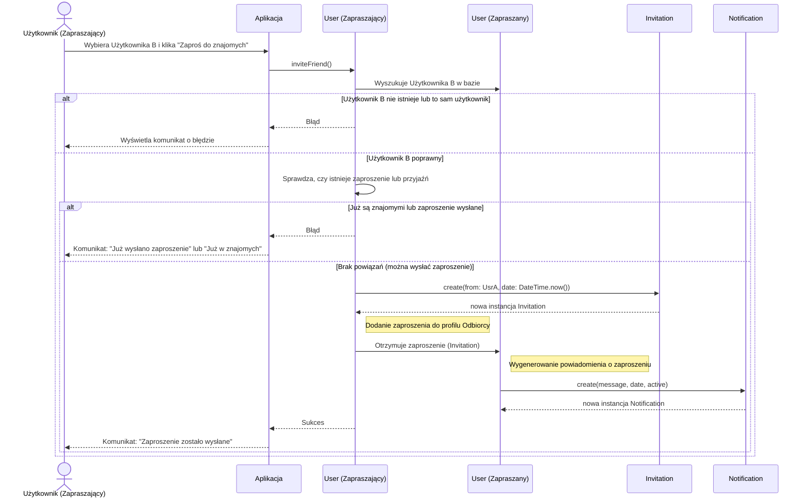

# Diagram sekwencji — zaaproszenie do znajomych

```mermaid
sequenceDiagram
    actor UA as Użytkownik (Zapraszający)
    participant UI as Aplikacja
    participant UsrA as User (Zapraszający)
    participant UsrB as User (Zapraszany)
    participant Inv as Invitation
    participant Notif as Notification

    UA->>UI: Wybiera Użytkownika B i klika "Zaproś do znajomych"
    UI->>UsrA: inviteFriend()

    UsrA->>UsrB: Wyszukuje Użytkownika B w bazie
    
    alt Użytkownik B nie istnieje lub to sam użytkownik
        UsrA-->>UI: Błąd
        UI-->>UA: Wyświetla komunikat o błędzie
    else Użytkownik B poprawny
        UsrA->>UsrA: Sprawdza, czy istnieje zaproszenie lub przyjaźń
        
        alt Już są znajomymi lub zaproszenie wysłane
            UsrA-->>UI: Błąd
            UI-->>UA: Komunikat: "Już wysłano zaproszenie" lub "Już w znajomych"
        else Brak powiązań (można wysłać zaproszenie)
            UsrA->>Inv: create(from: UsrA, date: DateTime.now())
            Inv-->>UsrA: nowa instancja Invitation
            
            note right of UsrA: Dodanie zaproszenia do profilu Odbiorcy
            UsrA->>UsrB: Otrzymuje zaproszenie (Invitation)
            
            note right of UsrB: Wygenerowanie powiadomienia o zaproszeniu
            UsrB->>Notif: create(message, date, active)
            Notif-->>UsrB: nowa instancja Notification
            
            UsrA-->>UI: Sukces
            UI-->>UA: Komunikat: "Zaproszenie zostało wysłane"
        end
    end
```
