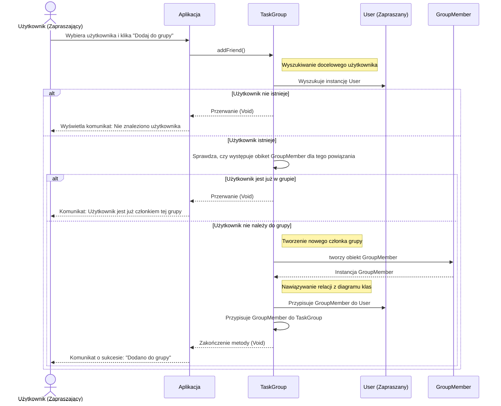

# Diagram sekwencji — dodawanie użytkownika do grupy zadań

```mermaid
sequenceDiagram
    actor U as Użytkownik (Zapraszający)
    participant UI as Aplikacja
    participant TG as TaskGroup
    participant Usr as User (Zapraszany)
    participant GM as GroupMember

    U->>UI: Wybiera użytkownika i klika "Dodaj do grupy"
    UI->>TG: addFriend()

    note right of TG: Wyszukiwanie docelowego użytkownika
    TG->>Usr: Wyszukuje instancję User
    
    alt Użytkownik nie istnieje
        TG-->>UI: Przerwanie (Void)
        UI-->>U: Wyświetla komunikat: Nie znaleziono użytkownika
    else Użytkownik istnieje
        TG->>TG: Sprawdza, czy występuje obiket GroupMember dla tego powiązania
        
        alt Użytkownik jest już w grupie
            TG-->>UI: Przerwanie (Void)
            UI-->>U: Komunikat: Użytkownik jest już członkiem tej grupy
        else Użytkownik nie należy do grupy
            note right of TG: Tworzenie nowego członka grupy
            TG->>GM: tworzy obiekt GroupMember
            GM-->>TG: Instancja GroupMember
            
            note right of TG: Nawiązywanie relacji z diagramu klas
            TG->>Usr: Przypisuje GroupMember do User
            TG->>TG: Przypisuje GroupMember do TaskGroup
            
            TG-->>UI: Zakończenie metody (Void)
            UI-->>U: Komunikat o sukcesie: "Dodano do grupy"
        end
    end
```
