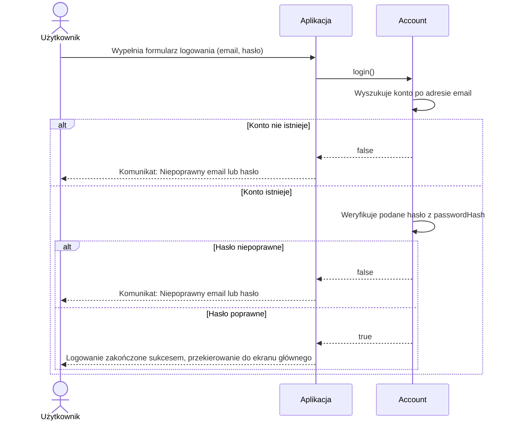

# Diagram sekwencji — logowanie

```mermaid
sequenceDiagram
    actor U as Użytkownik
    participant UI as Aplikacja
    participant Acc as Account

    U->>UI: Wypełnia formularz logowania (email, hasło)
    UI->>Acc: login()

    Acc->>Acc: Wyszukuje konto po adresie email
    
    alt Konto nie istnieje
        Acc-->>UI: false
        UI-->>U: Komunikat: Niepoprawny email lub hasło
    else Konto istnieje
        Acc->>Acc: Weryfikuje podane hasło z passwordHash
        alt Hasło niepoprawne
            Acc-->>UI: false
            UI-->>U: Komunikat: Niepoprawny email lub hasło
        else Hasło poprawne
            Acc-->>UI: true
            UI-->>U: Logowanie zakończone sukcesem, przekierowanie do ekranu głównego
        end
    end
```
